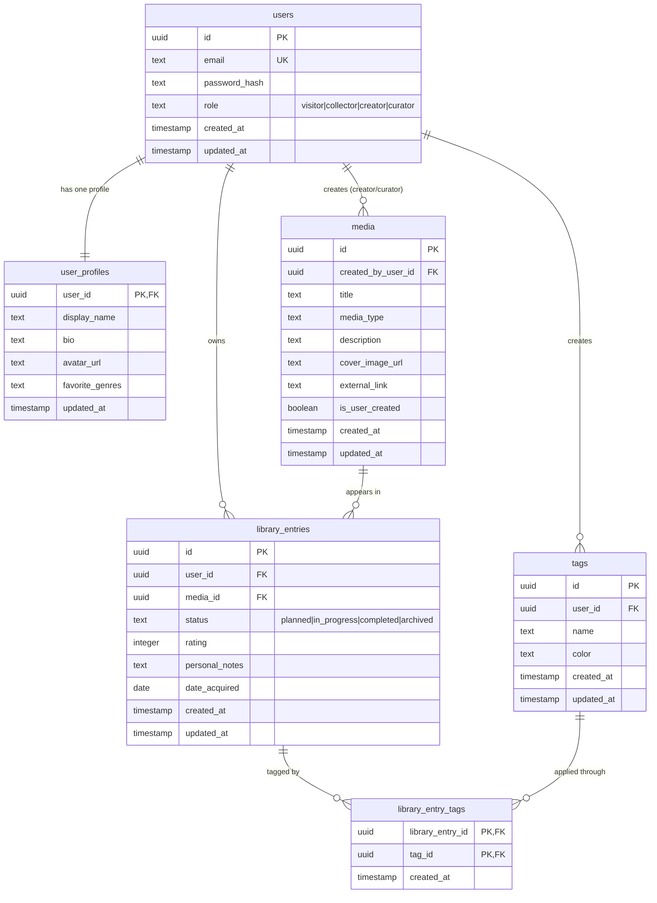

# Entity Relationship Diagram

Reference the Creating an Entity Relationship Diagram final project guide in the course portal for more information about how to complete this deliverable.

## Create the List of Tables

[👉🏾👉🏾👉🏾 List each table in your diagram]

## Add the Entity Relationship Diagram

[👉🏾👉🏾👉🏾 Include an image or images of the diagram below. You may also wish to use the following markdown syntax to outline each table, as per your preference.]

| Column Name | Type | Description |
|-------------|------|-------------|
| id | integer | primary key |
| name | text | name of the shoe model |
| ... | ... | ... |

## Milestone 1 Completed ERD Content

### Final Table List

1. `users`
2. `user_profiles`
3. `media`
4. `library_entries`
5. `tags`
6. `library_entry_tags`

### Mermaid Diagram

### Detailed Table Definitions

#### 1) `users`
Primary identity and authentication table.

| Column | Type | Constraints | Purpose |
|---|---|---|---|
| id | UUID | PK, default generated | User identity key used by all related tables |
| email | TEXT | NOT NULL, UNIQUE | Login identifier |
| password_hash | TEXT | NOT NULL | Secure hash (never plain password) |
| role | TEXT | NOT NULL, CHECK in allowed roles | Authorization decisions |
| created_at | TIMESTAMP | NOT NULL default now() | Record creation audit |
| updated_at | TIMESTAMP | NOT NULL default now() | Update audit |

#### 2) `user_profiles`
One-to-one extension of users for profile metadata.

| Column | Type | Constraints | Purpose |
|---|---|---|---|
| user_id | UUID | PK, FK -> users(id), ON DELETE CASCADE | Enforces exactly one profile per user key |
| display_name | TEXT | NULLABLE | Public profile name |
| bio | TEXT | NULLABLE | User bio text |
| avatar_url | TEXT | NULLABLE | Profile image URL |
| favorite_genres | TEXT | NULLABLE | Optional preference summary |
| updated_at | TIMESTAMP | NOT NULL default now() | Profile update audit |

#### 3) `media`
Global catalog containing seeded and user-created media.

| Column | Type | Constraints | Purpose |
|---|---|---|---|
| id | UUID | PK | Media identity |
| created_by_user_id | UUID | FK -> users(id), NULLABLE | Tracks who created custom entries |
| title | TEXT | NOT NULL | Media title |
| media_type | TEXT | NOT NULL, CHECK enum | Book/movie/music/podcast/video/etc |
| description | TEXT | NULLABLE | Context for discovery |
| cover_image_url | TEXT | NULLABLE | Cloud-hosted image URL |
| external_link | TEXT | NULLABLE | Link to platform/source |
| is_user_created | BOOLEAN | NOT NULL default false | Distinguishes seeded vs user-made |
| created_at | TIMESTAMP | NOT NULL default now() | Creation audit |
| updated_at | TIMESTAMP | NOT NULL default now() | Update audit |

#### 4) `library_entries`
Core personal collection table linking users to media.

| Column | Type | Constraints | Purpose |
|---|---|---|---|
| id | UUID | PK | Library entry identity |
| user_id | UUID | FK -> users(id), NOT NULL | Owner of entry |
| media_id | UUID | FK -> media(id), NOT NULL | Referenced catalog item |
| status | TEXT | CHECK enum | Progress in user collection |
| rating | INTEGER | CHECK 1-5 or NULL | Personal rating |
| personal_notes | TEXT | NULLABLE | User commentary |
| date_acquired | DATE | NULLABLE | Acquisition timeline |
| created_at | TIMESTAMP | NOT NULL default now() | Creation audit |
| updated_at | TIMESTAMP | NOT NULL default now() | Update audit |

Recommended unique rule: `UNIQUE (user_id, media_id)` to avoid duplicate ownership rows per user-media pair.

#### 5) `tags`
User-defined labels for organizing personal libraries.

| Column | Type | Constraints | Purpose |
|---|---|---|---|
| id | UUID | PK | Tag identity |
| user_id | UUID | FK -> users(id), NOT NULL | Tag owner |
| name | TEXT | NOT NULL | Tag display text |
| color | TEXT | NULLABLE | Optional UI color metadata |
| created_at | TIMESTAMP | NOT NULL default now() | Creation audit |
| updated_at | TIMESTAMP | NOT NULL default now() | Update audit |

Recommended unique rule: `UNIQUE (user_id, name)` to prevent duplicate tag labels for the same user.

#### 6) `library_entry_tags`
Join table enabling many-to-many between `library_entries` and `tags`.

| Column | Type | Constraints | Purpose |
|---|---|---|---|
| library_entry_id | UUID | PK, FK -> library_entries(id), ON DELETE CASCADE | Taggable library item |
| tag_id | UUID | PK, FK -> tags(id), ON DELETE CASCADE | Applied tag |
| created_at | TIMESTAMP | NOT NULL default now() | Assignment audit |

Composite PK (`library_entry_id`, `tag_id`) prevents duplicate tag assignment on the same entry.

### Relationship Enforcement and Requirement Mapping

1. **One-to-One Requirement (`users` ↔ `user_profiles`)**
   - Implemented by using `user_profiles.user_id` as both PK and FK.
   - This ensures each profile row maps to exactly one user and cannot exist without that user.

2. **One-to-Many Requirements**
   - `users -> library_entries`: one user can own many library entries.
   - `media -> library_entries`: one media item can appear in many users’ libraries.
   - `users -> media`: one creator/curator can create many custom catalog records.
   - `users -> tags`: one user can define many custom tags.

3. **Many-to-Many Requirement (`library_entries` ↔ `tags`)**
   - Implemented with `library_entry_tags`.
   - One library entry can have many tags; one tag can be reused across many entries (within ownership rules).

4. **Ownership + Authorization Support**
   - `user_id` on `library_entries` and `tags` enables ownership checks in API handlers.
   - `created_by_user_id` on `media` supports creator attribution and role-based edit restrictions.
