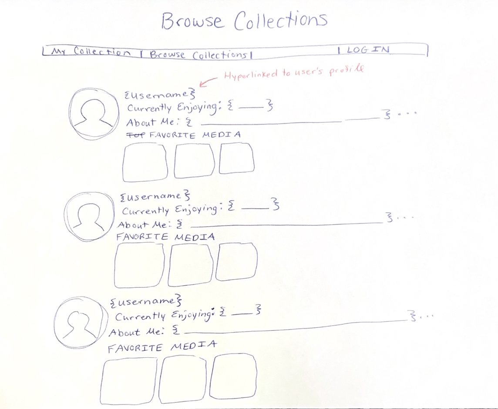
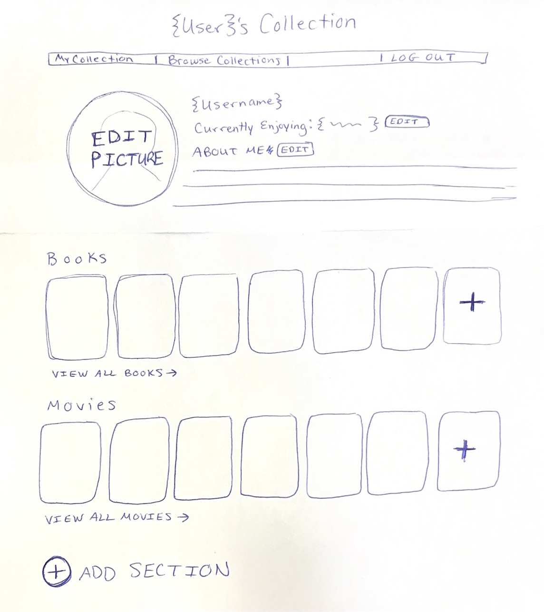
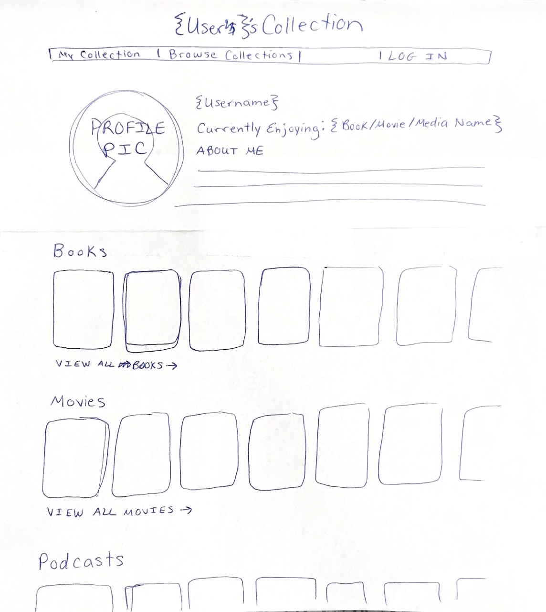
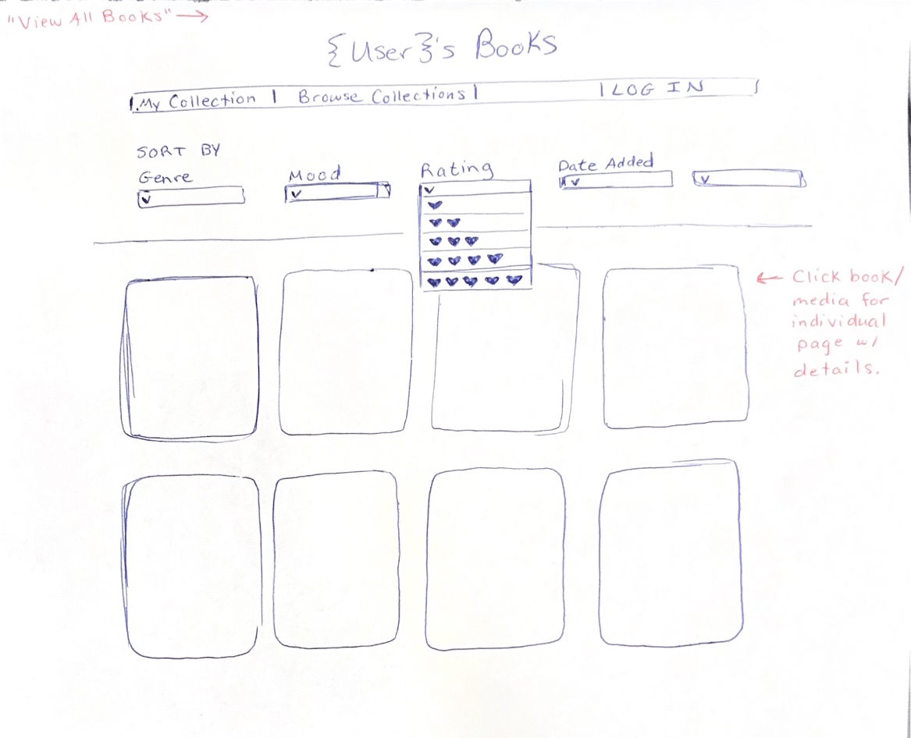
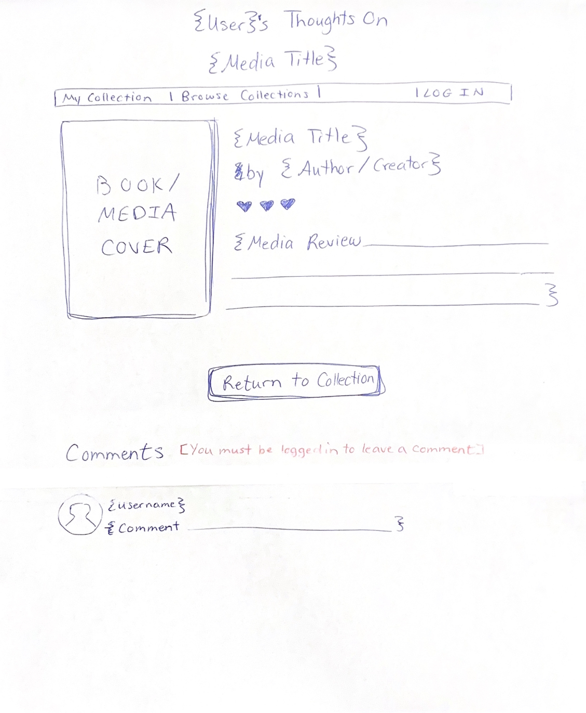

# Wireframes

Reference the Creating an Entity Relationship Diagram final project guide in the course portal for more information about how to complete this deliverable.

## List of Pages
⭐Browse Collections 
⭐User Profile (Logged In) 
⭐User Profile (Logged Out) 
⭐Sort User's Media 
⭐Media Detail View 
- Add Media Form (Modal)
- Edit/Update Media Form (Modal)

## Wireframe 1: Browse Collections

## Wireframe 2: User Profile (Logged In)

## Wireframe 3: User Profile (Logged Out)

## Wireframe 4: Sort User's Media

## Wireframe 5: Media Detail View

